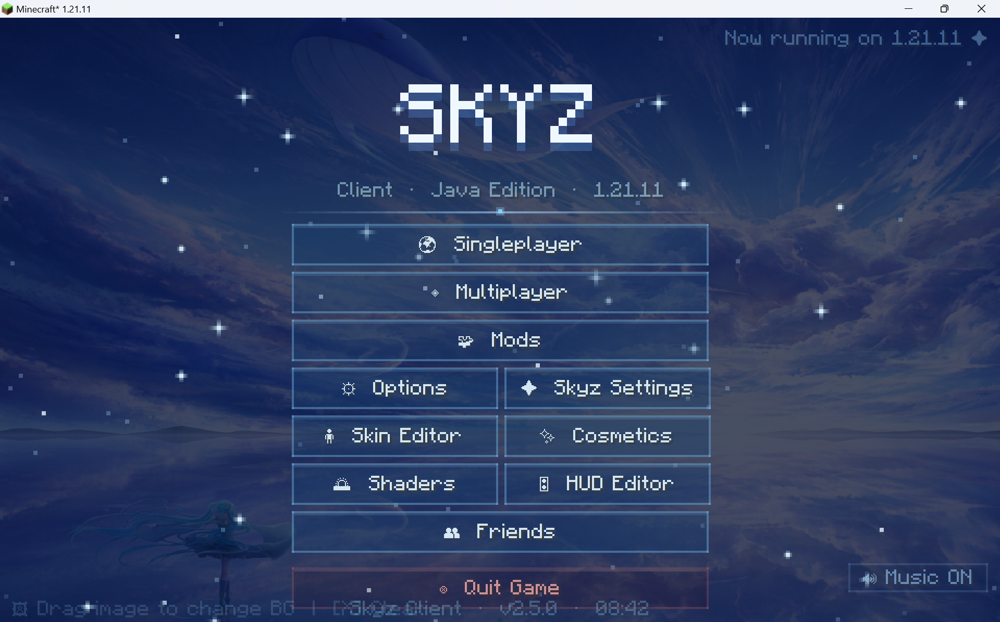
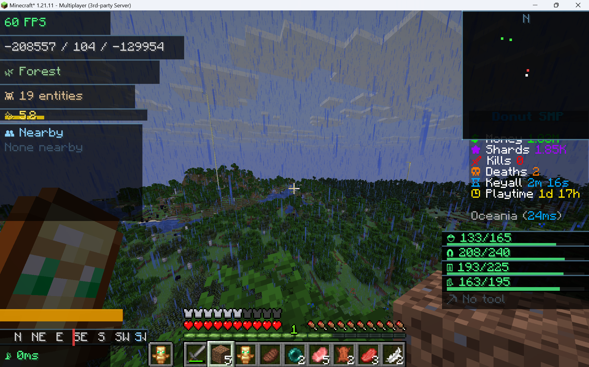
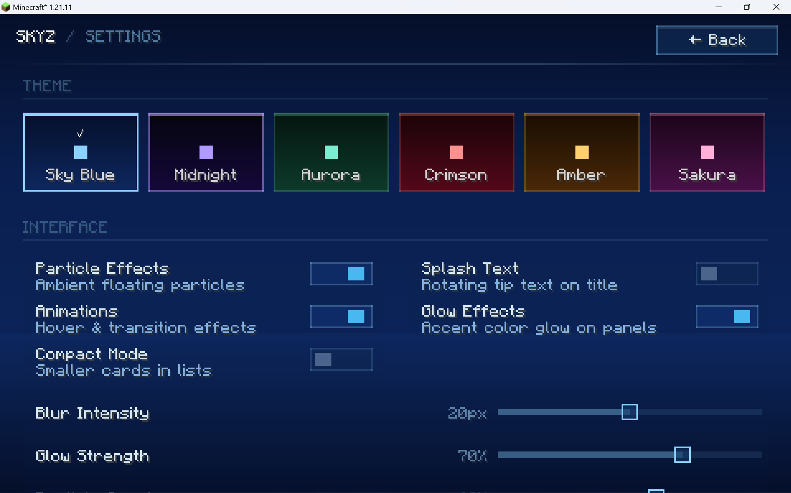

# 🌌 Skyz Client — v2.9.0

> **Look up. Fly higher.**  
> Skyz Client is a free, open-source, and highly customizable Minecraft: Java Edition client built on Fabric. It transforms the vanilla experience with modern aesthetics, enhanced performance, and integrated utility tools.

### 🌐 [View the Marketing Page →](https://tm-coder-484.github.io/Skyz-Client/)

---

## ✨ Key Features

### 🚀 Performance First
Skyz Client integrates the best optimization mods to ensure a buttery-smooth experience:
* **Sodium (v0.8.2)** — Massive rendering overhaul for higher FPS.
* **Lithium (v0.14.3)** — Game logic and physics optimizations.
* **FerriteCore (v7.0.0)** — Drastically reduces memory usage.
* **Iris (v1.10.4)** — Full shader support for breathtaking visuals.

### 🎨 Modern UI & Design
Experience a clean, futuristic interface designed for clarity and style:
* **Glassmorphism Design** — Frosted glass effects and sleek transparency.
* **Dynamic HUD Editor** — Customize your on-screen elements with ease.
* **Curated Themes** — Switch between *Midnight*, *Aurora*, and *Sakura*.
* **Animated Menus** — Fluid transitions and interactive elements.

### 🛠️ Integrated Modules
* **Customization** — Built-in skin editor and a wide array of cosmetics.
* **Social** — Seamless friends and chat system integration.
* **PvP Suite** — High-precision tools including CPS counters and keystrokes.
* **Dynamic Backgrounds** — Drag-and-drop any image onto the title screen to customize your vibe.
* **Audio Customization** — Set your own background music directly in the `.minecraft` folder.

---

## 📸 Screenshots

| Main Menu | Custom HUD | Settings |
| :---: | :---: | :---: |
|  |  |  |

---

## 📥 Installation

### ⚡ Quick Start
1. **Download** the latest release from the [Releases](https://github.com/tm-coder-484/Skyz-Client/releases) page.
2. **Install Fabric Loader (1.21.11)** from [fabricmc.net](https://fabricmc.net/use/installer/).
3. **Add Fabric API** and the `skyz-client-2.9.0.jar` to your `mods` folder.
4. **Launch** and enjoy!

### 🛠️ For Developers (Building from Source)
Want to build it yourself? Check out our detailed [Build Guide](how_to_build.md) for step-by-step instructions on setting up Java 21 and Gradle.

---

## 🛠️ Technical Specifications

| Component | Version |
| :--- | :--- |
| **Minecraft** | 1.21.11 |
| **Fabric Loader** | 0.16.10 |
| **Fabric API** | 0.140.2+1.21.11 |
| **Java Runtime** | 21 (LTS) |

---

## 🤝 Contributing

We welcome contributions from the community! Whether it's a bug fix or a new feature:
1. Check the [Contributing Guide](CONTRIBUTING.md).
2. Open an issue to discuss your idea.
3. Submit a Pull Request.

## 📜 License

Distributed under the **MIT License**. See `LICENSE` for more information.
