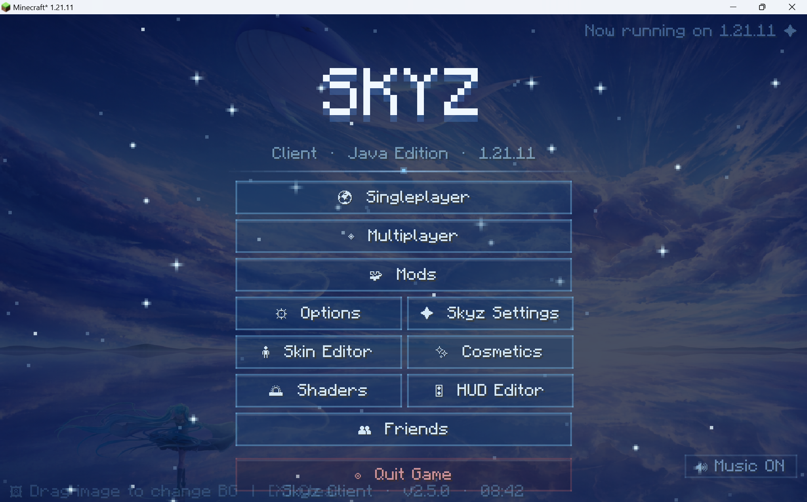
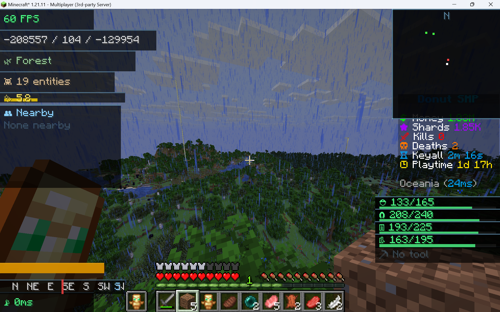
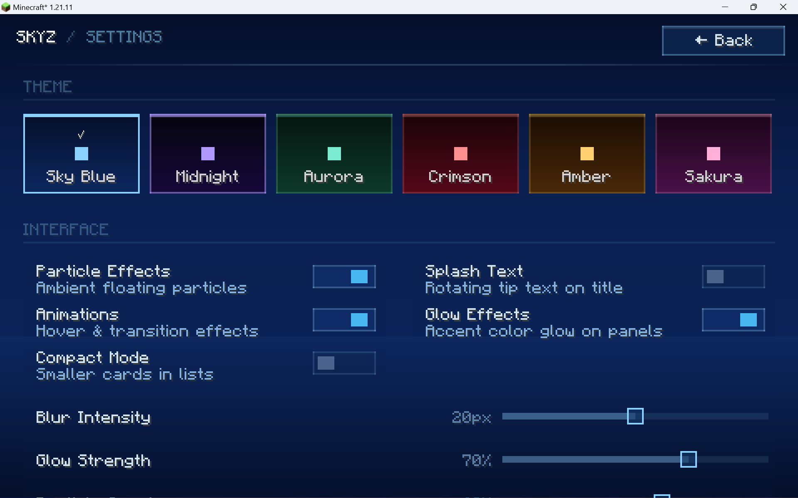

# 🌌 Skyz Client — v4.3.1


> **Look up. Fly higher.**
> Skyz Client is a free, open-source, client-side Fabric mod for Minecraft 1.21.11 that replaces the vanilla title screen, pause menu, multiplayer browser, options, and most other UI surfaces with a polished, modern design system — plus an in-game HUD editor, ESP / spawner-alert / block-ESP overlays, and tight integration with Sodium, Iris, Distant Horizons, Mod Menu, and Essential.

### 🌐 [View the Marketing Page →](https://tm-coder-484.github.io/Skyz-Client/)

---

## ✨ Highlights

### 🎨 Reskinned UI Surfaces
Almost every screen Minecraft shows is replaced with a Skyz-styled equivalent — XML-driven layouts on top of [owo-lib](https://github.com/wisp-forest/owo-lib), with Java handling state and routing.

| Surface | Replaced |
| :--- | :--- |
| Title screen | ✅ Particles, dynamic background, animated logo, version splash |
| Pause menu | ✅ Achievements / Stats / Feedback / LAN / Save & Quit / Disconnect |
| Multiplayer | ✅ Server list with async pinger, scroll, add-server flow |
| Singleplayer | ✅ World list with thumbnails |
| Options | ✅ Routing screen with mod-shortcuts row |
| Settings | ✅ Themes, interface toggles, minimap, block ESP, ESP range |
| Mods | ✅ Searchable mod list with categories + ModMenu integration |
| Shaders | ✅ Pack picker with Iris integration |
| Friends / Cosmetics | ✅ Direct routing to Essential's social menu / wardrobe |
| Death / Disconnected | ✅ Themed |
| Message / Progress loading | ✅ Themed loading transitions |

### 🛠️ Tools & Overlays
* **HUD Editor** — Drag-drop layout for 20+ HUD elements (CPS, FPS, coords, biome, armor durability, minimap, clock, combo counter, totem pops, nearby players, …). Layouts persist to JSON.
* **Block ESP** — Toggle outlines for 25 groups (Diamond/Emerald/Gold/Iron/Coal/Redstone/Lapis/Copper ores, Ancient Debris, Spawners, Trial Spawners, Vaults, Chests, Barrels, Shulker Boxes, Ender Chests, Hoppers, Furnaces, Beacons, Conduits, Beehives, End Portal Frames, Sculk Catalysts, Mob Heads, Crafters, TNT). Each group has its own color swatch. Background daemon thread scans loaded chunks every ~1.5 s; render thread reads a `volatile` snapshot. Block-entity blocks use the cheap `chunk.getBlockEntities()` walk; plain blocks use a `ChunkSection.hasAny()` palette pre-check so empty sections are skipped.
* **Spawner / Vault Alert** — Pings (sound + chat) when a Spawner, Trial Spawner, or **Ominous** Vault enters range. De-duped per session so each spawner only pings once.
* **Storage / Player / Mob ESP** — Outline boxes with color-coded categories (chest/barrel/shulker/hopper/furnace; player health gradient; hostile vs passive).
* **Global ESP Range Slider** — 4–32 chunks, drives every ESP / alert / nearby-player scan from a single setting.

### ⚡ QoL Toggles
Fullbright (gamma override), No Fog, No Pumpkin Overlay, No Fire Overlay, Toggle Sprint, Toggle Sneak, Anti-AFK (jump every 30 s), Auto-GG, Autoclicker (CPS-controlled, mob-only), Dynamic FPS (drop to 30 when window unfocused), Particle Limiter, Chat Timestamps, FOV multiplier slider.

### 🎯 Mod Integration
Skyz auto-detects installed mods and routes to their native config screens:
* **Sodium 0.8+** → `VideoSettingsScreen.createScreen(Screen)` factory (matches their post-0.8 private-ctor refactor)
* **Iris** → `ShaderPackScreen(Screen)` constructor
* **Distant Horizons** → ModMenu factory with reflection fallback
* **Mod Menu** → standard `ModMenuApi.createModsScreen`
* **Essential** → Wardrobe / Social menu via reflection across known Kotlin singleton paths

A "Mod Shortcuts" row pins these to the top of the Options screen when installed — same placement vanilla uses for the Distant Horizons button.

### 🎨 Themes
Six built-in themes — *Midnight*, *Aurora*, *Sakura*, *Solar*, *Ember*, *Glacier*. Each repaints the entire app (gradients, accents, surfaces, button hover states). Switch on the fly from Settings → Theme. Persists to JSON.

---

## 📸 Screenshots

| Main Menu | Custom HUD | Settings |
| :---: | :---: | :---: |
|  |  |  |

---

## 📥 Installation

### ⚡ Quick Start
1. **Install Fabric Loader 0.17.3** (or newer) for Minecraft 1.21.11 from [fabricmc.net](https://fabricmc.net/use/installer/).
2. **Drop these into your `mods` folder:**
   * `fabric-api-0.140.2+1.21.11.jar` (or newer) — [download](https://modrinth.com/mod/fabric-api)
   * `skyz-client-4.3.1.jar` — from the [Releases](https://github.com/tm-coder-484/Skyz-Client/releases) page
3. **Optional but recommended** (auto-integrated when present):
   * **Sodium** 0.8.7+ — performance + Video Settings re-skin
   * **Iris** — shader pack support (Shaders screen wires into Iris automatically)
   * **Distant Horizons** — adds a DH shortcut to the top of Options
   * **Mod Menu** — unlocks CONFIG buttons on mod cards in the Mods screen
   * **Essential** — Friends + Cosmetics buttons route to Essential's screens
4. **Launch** and enjoy.

### 🛠️ Building from Source
```bash
git clone https://github.com/tm-coder-484/Skyz-Client.git
cd Skyz-Client
./gradlew build      # Linux/macOS
.\gradlew.bat build  # Windows
```
Output lands at `build/libs/skyz-client-4.3.1.jar`. See [how_to_build.md](how_to_build.md) for full details, JDK setup, and the dev iteration loop.

---

## 🛠️ Technical Specifications

| Component | Version |
| :--- | :--- |
| **Minecraft** | 1.21.11 |
| **Fabric Loader** | 0.17.3 |
| **Fabric API** | 0.140.2+1.21.11 |
| **Yarn Mappings** | 1.21.11+build.1 |
| **Java Runtime** | 21 (LTS) |
| **owo-lib** | 0.13.0+1.21.11 |

**Side**: client-only (no server install required).

---

## 🤝 Contributing

Bug reports, feature ideas, and PRs all welcome.
1. Check the [Contributing Guide](CONTRIBUTING.md).
2. Open an issue to discuss your idea or report a bug.
3. Submit a Pull Request against `main`.

## 📜 License

Distributed under the **MIT License**. See `LICENSE` for full text.
